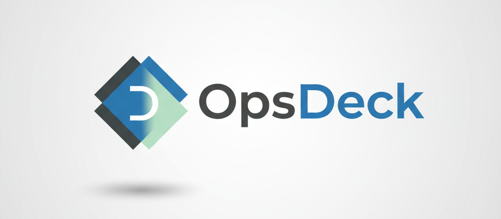

# OpsDeck
For IT managers and operations teams struggling with disconnected tools and sprawling spreadsheets, OpsDeck is the all-in-one control center that unifies asset management, vendor relations, and compliance into a single, intuitive platform. Ditch the chaos and gain complete visibility and control over your entire IT ecosystem, from procurement to disposal.

## Key Features
OpsDeck provides a comprehensive suite of tools to streamline your IT operations:

### Asset Lifecycle Management
- Complete Asset Tracking: Monitor hardware, software, and peripherals from purchase to end-of-life.

- Check-in/Check-out: Easily assign assets to users and track assignment history.

- Warranty Monitoring: Receive automatic alerts for expiring warranties.

- Maintenance & Disposal: Log all maintenance activities and manage formal disposal records.

- Location Management: Track the physical location of all your assets.

### Vendor & Procurement Management
- Supplier Database: A centralized repository for all vendor information, contracts, and compliance status.

- Purchase Management: Create and track purchase orders, linking them to assets, budgets, and suppliers.

- Budget Oversight: Define budgets by category and monitor spending in real-time.

- Service & Subscription Tracking: Never miss a renewal with proactive tracking of all recurring services and software licenses.

### Governance, Risk & Compliance (GRC)
- Policy Management: Create and version control policies, and track employee acknowledgements.

- Risk Register: Identify, assess, and document mitigation plans for organizational risks.

- Security Incident Management: A complete workflow to log, investigate, and resolve security incidents, including Post-Incident Reviews (PIR).

- Auditing: Conduct asset audits to ensure inventory accuracy and accountability.

### Team & Resource Management
- User Directory: Manage user profiles, assigned assets, and contact information.

- Training Hub: Create training courses, assign them to users or groups, and track completion.

- Team Grouping: Organize users into groups for easier policy and asset assignment.

### Financial Oversight & Reporting
- Depreciation Reports: Automatically calculate and visualize asset depreciation.

- Spend Analysis: Gain insights into spending patterns by supplier, brand, or asset type.

- Subscription Forecasting: Project future costs for all recurring services.

## Tech Stack
* Backend: Python 3, Flask
* Database: SQLAlchemy ORM, Flask-Migrate (for database migrations). Defaults to SQLite.
* Frontend: Jinja2 Templates, Bootstrap 5
* Scheduling: APScheduler

## Setup and Installation
Follow these steps to get the application running locally.

1. Prerequisites
* Python 3.10+
* A virtual environment tool (venv)

2. Installation
```bash

# Clone the repository (or use your existing project folder)
# git clone https://github.com/pixelotes/opsdeck.git
# cd opsdeck

# Create and activate a virtual environment
python3 -m venv venv
source venv/bin/activate

# Install the required Python packages
pip install -r requirements.txt
```
3. Configuration
The application is configured using environment variables. Create a file named .env in the root of the project and add the following variables.

`.env.example`:

```bash

# Flask Configuration
SECRET_KEY='a-very-strong-and-random-secret-key'
FLASK_APP=run:app

# Database URL (optional, defaults to a local SQLite file)
# DATABASE_URL='sqlite:///renewals.db'

# SMTP Email Notification Settings (optional)
SMTP_SERVER='smtp.gmail.com'
SMTP_PORT=587
EMAIL_USERNAME='your-email@gmail.com'
EMAIL_PASSWORD='your-gmail-app-password'

# Webhook Notification Settings (optional)
# WEBHOOK_URL='https://your-webhook-provider.com/...'
```
* `SECRET_KEY`: Required. A long, random string used for signing sessions.
* `FLASK_APP`: Required. Tells Flask how to load the application.
* SMTP variables: Only required if you want to use email notifications. For Gmail, you will need to generate an "App Password".

4. Initialize the Database
The first time you run the app, you need to create the database and the initial admin user.

```bash

# 1. Initialize the migrations folder (only run this once ever)
flask db init

# 2. Create the first migration script
flask db migrate -m "Initial migration"

# 3. Apply the migration to create all tables
flask db upgrade

# 4. Create the default admin user (admin/admin123)
flask init-db
```

## Usage
To run the application, use the Flask CLI:

```bash

flask run
```
The application will be available at http://127.0.0.1:5000.

* Default Login:
  + Username: admin
  + Password: admin123 (It's recommended to change this)
