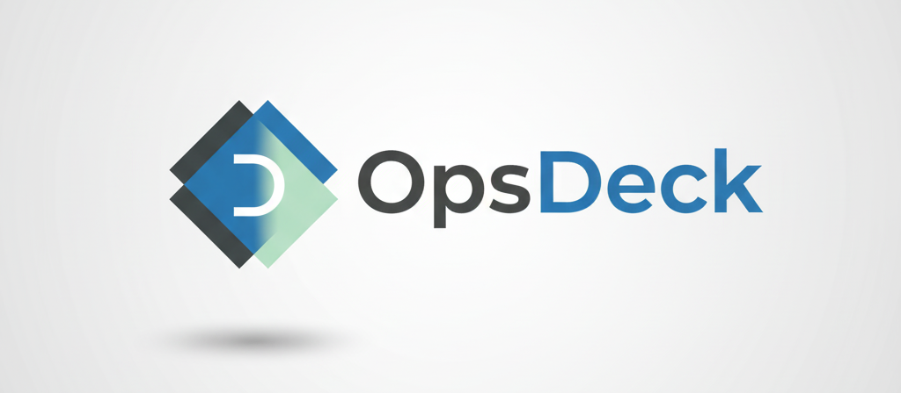

# OpsDeck

IT operations and governance platform for regulated environments.

**[Documentation](https://pixelotes.github.io/opsdeck-web)**

---


## What It Does

OpsDeck consolidates the essential operational and governance needs of IT teams into a single platform:

| Module | Description |
|--------|-------------|
| **Asset Lifecycle Management** | Track hardware from procurement to disposal with maintenance logs, assignment history, and warranty tracking |
| **Compliance & Audit Defense** | Continuous monitoring for SOC 2 and ISO 27001 with automated evidence collection and compliance drift detection |
| **User Access Review (UAR)** | Automated comparisons between systems to detect orphaned accounts and access mismatches |
| **Service Catalog** | Map business services to their technical dependencies and understand impact chains |
| **Risk & Security Operations** | Incident tracking, risk register, internal credential vault, and full audit trails |
| **Vendor Management** | Supplier tracking with compliance status, contract lifecycle, and renewal forecasting |
| **Policy & Training** | Policy acknowledgment workflows and training assignment tracking linked to compliance controls |

Built for mid-market IT teams (50-500 employees) in finance, healthcare, SaaS, and other regulated industries.

## Quick Start

### Local Development

```bash
# Clone and setup
git clone https://github.com/pixelotes/opsdeck.git
cd opsdeck
python3 -m venv venv
source venv/bin/activate
pip install -r requirements.txt

# Initialize database
flask db upgrade
flask init-db
flask seed-db-prod

# Run
flask run --debug
```

Access at `http://127.0.0.1:5000` with default credentials `admin@example.com` / `admin123` (you'll be prompted to change on first login).

### Docker

```bash
docker-compose up -d --build
```

> For production configuration (PostgreSQL, TLS, backups, monitoring), see the [deployment guide](https://pixelotes.github.io/opsdeck-web).

## Tech Stack

| Component | Technology |
|-----------|-----------|
| Backend | Python 3 + Flask |
| ORM | SQLAlchemy |
| Frontend | Bootstrap 5 |
| Scheduler | APScheduler |
| Database | PostgreSQL |

## Key Features

- **Automated User Access Reviews** — Schedule comparisons between systems (HRIS vs. IDP, AD vs. database) with automated finding detection and bulk remediation.
- **Compliance Drift Detection** — Daily snapshots with automatic alerting when controls regress. Timeline visualization over configurable periods.
- **Audit Defense Interface** — Immutable compliance snapshots, continuous evidence linking, and exportable evidence packages for auditors.
- **Service Dependency Mapping** — Understand which assets, vendors, and systems support business services. Impact analysis for incidents and changes.
- **Universal Search** — Search across assets, users, incidents, findings, vendors, and compliance controls with faceted filtering. Results are scoped to the modules each user can read.
- **REST API** — Programmatic access with bearer token authentication. OpenAPI documentation at `/swagger-ui`.

## Documentation

Full documentation is available at **[pixelotes.github.io/opsdeck-web](https://pixelotes.github.io/opsdeck-web)**.

## License

[Elastic License](./LICENSE) — Free to use and modify, restrictions on offering as a managed service.

---

Built for IT teams who need operational excellence without operational overhead.

---
