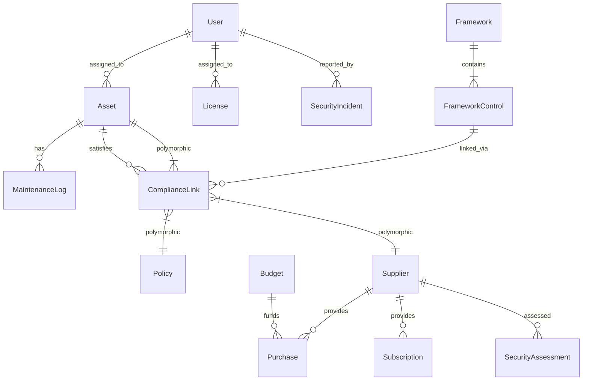

# Database Structure

OpsDeck uses a relational database (SQLAlchemy ORM) with a modular structure. The models are organized by domain in `src/models/`.

## Core Models (`src/models/core.py`)
- **User**: System users with roles (admin, user).
- **Group**: User groups for organization and permissions.
- **Location**: Physical locations for assets and users.
- **Tag**: Generic tags for categorizing objects.
- **Link**: External links (bookmarks) managed by the system.
- **Documentation**: Internal documentation pages.
- **NotificationSetting**: Configuration for email and webhook notifications.

## Assets (`src/models/assets.py`)
- **Asset**: The core entity representing hardware. Tracks status, location, user assignment, and financial details.
- **Peripheral**: Smaller hardware items (keyboards, mice) associated with assets or users.
- **Software**: Software titles tracked in the system.
- **License**: Software licenses linked to Software and assigned to Assets/Users.
- **MaintenanceLog**: Records of repairs and maintenance for Assets.
- **DisposalRecord**: Formal records of asset disposal.

## Procurement (`src/models/procurement.py`)
- **Supplier**: Vendors and service providers.
- **Contact**: Points of contact at suppliers.
- **Budget**: Financial budgets categorized by type and year.
- **Purchase**: Purchase orders or records, linked to Suppliers and Budgets.
- **Subscription**: Recurring services or software subscriptions.
- **PaymentMethod**: Credit cards or other payment methods used for subscriptions.

## Security & Compliance (`src/models/security.py`, `src/models/compliance.py`)
- **Framework**: Compliance frameworks (e.g., ISO 27001, SOC 2).
- **FrameworkControl**: Specific controls within a framework.
- **ComplianceLink**: Polymorphic link connecting a `FrameworkControl` to any other system object (Asset, Policy, etc.) with a justification.
- **SecurityIncident**: Records of security incidents and breaches.
- **SecurityAssessment**: Vendor or internal security assessments.
- **Risk**: Risk register items with probability and impact scoring.
- **Audit**: Asset audits to verify inventory.

## Policy (`src/models/policy.py`)
- **Policy**: Governance policies (e.g., Acceptable Use Policy).
- **PolicyVersion**: Version history of policies.
- **PolicyAcknowledgement**: Records of users acknowledging policies.

## BCDR (`src/models/bcdr.py`)
- **BCDRPlan**: Business Continuity and Disaster Recovery plans.
- **BCDRTestLog**: Logs of BCDR plan tests and exercises.

## Training (`src/models/training.py`)
- **Course**: Training courses available to users.
- **CourseAssignment**: Assignment of courses to users or groups.
- **CourseCompletion**: Records of users completing courses.

## Relationships Diagram (Conceptual)

